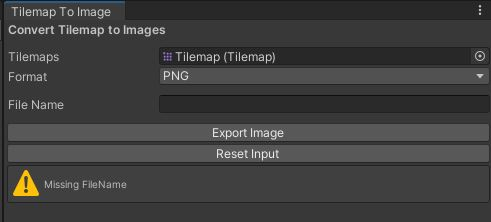
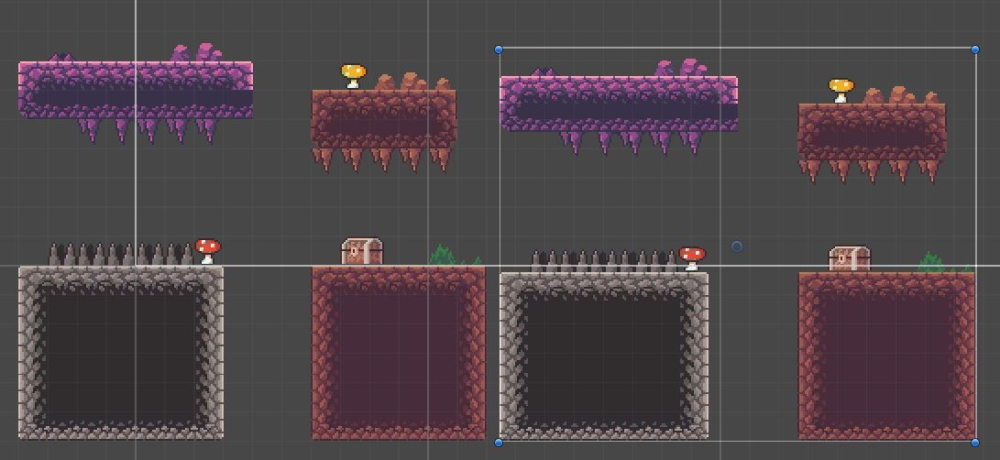

# FromTiles2Images

**FromTiles2Images** is a lightweight, drag-and-drop tool to convert Unity 2D tilemap into image format (e.g .png).

The tool is still under development, any contribution and feedback is welcomed!

* Use on tilemap with **Regtangle-Grid** based
* Easy & lightweight. Simple UI.
* Support four image format: **PNG**, **JPG**, **EXR**, **TGA**.
* Automatic set texture readable/writable.
* Automatically crop the texture from original tilemap.
* Provide a simple editor window to work with.
* Include a sample scene & sprite exported for demo.

## Installation

- Clone this repository.
- Import the **.unitypackage** file (recommended)

## Motivation (or Rant?)

You have a wonderful spritesheet, you create a tilemap from it but then you want to use it as a **prefab**. What can be your solutions?
- You may create multiple **gameObject**, each with single *Sprite* of the tilemap, then group them into one single **gameObject**, then make it into a prefab? (*spoil*: It's totally insane and can put you into an *existential crisis*)
- You may use third-party software to creat tilemaps then export it (such as **Tiled**). The bad new is that not many Tilemap Editors that are free, also I tried **Tiled** onced and I hate it (I basically gave up after 10 minutes!)
- Then you surf the internet, aha, it's seem that there is not much of result as well.
- Of course, **leocub58** wrote a free package to solve this problem. However, several weakness can be pointed out, for example:
  
  1. Exported images are in low resolution.
  2. His algorithm sometime make unwanted/incorrect crop from the original tilemap.
  3. The script must be attached into tilemap to work.
  4. Comment written in Spanish?
   
Finally, aside from **leocub58** I found no more package that can achieve the same objective. Hence, I decided to write my own custom library!

## How It Works

1. Open **Tilemap To Image** window. By default it is in the toolbar *Window/Tilemap2Img*
2. Prepare a Grid & Tilemaps. 
3. Drag the tilemap (gameObject) into the Window **Tilemap to Image**
4. Fill in the name (optional)
5. Hit the "*Export image*" button

## Demostration
Tilemap is on the Left, on the right is the exported sprite that had been re-imported into the project.

## Further Development & Limitation
- Implement algorithm to work with Hexagon & Isometric Grid.
- There are often more than one tilemap be used in the same time to create layers. Current implemtation only export one tilemap into one single image.
  
## Acknowledgement

- I used *raimundonc* sprite assest to create the demo in the sample scene. Original link: https://raimundonc.itch.io/platform-dcave-tileset
- **leocub58**: For giving me inspiration and idea to creat the package. Original repo: https://github.com/leocub58/Tilemap-to-PNG-Unity
- The package is developed in **Unity 2020.3.2f1**.
